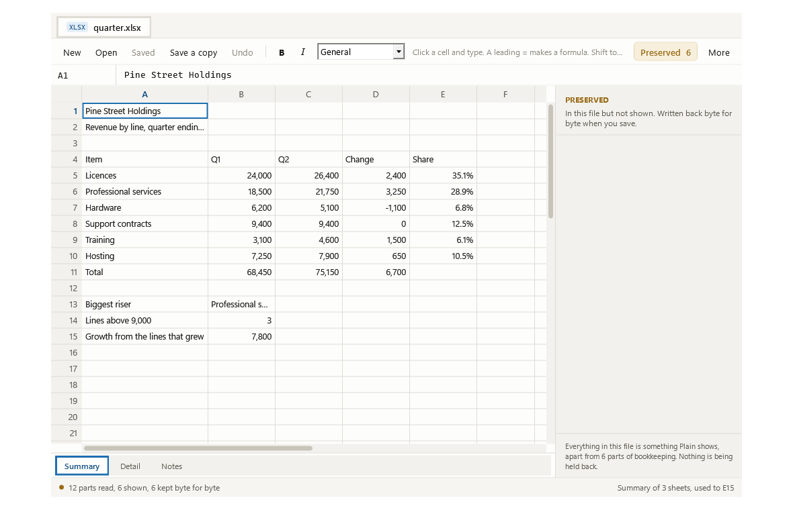
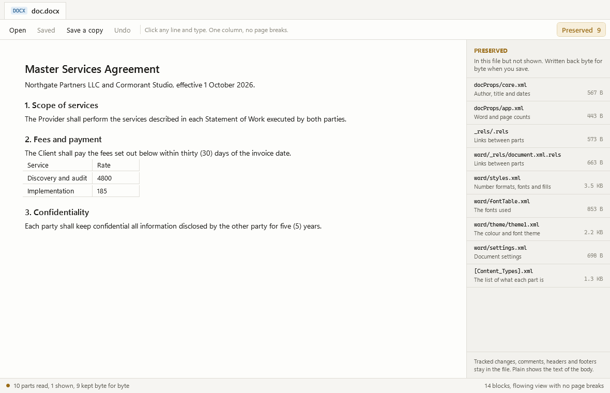
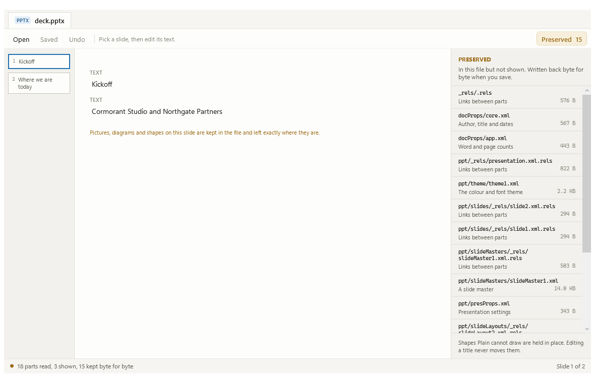

# Plain for Windows

Opens Word, Excel and PowerPoint files, edits the basics, and never damages what it doesn't understand.

One window. No ribbon, no account, no cloud, no assistant. Open a file, change the words or the numbers, save. Everything in the file that Plain cannot draw is listed on the right and written back exactly as it was found.



## Download

**[Plain-for-Windows-1.0.0-x64.exe](https://github.com/keithadler/plainwin/releases/latest/download/Plain-for-Windows-1.0.0-x64.exe)** for ordinary Intel and AMD PCs, or **[Plain-for-Windows-1.0.0-arm64.exe](https://github.com/keithadler/plainwin/releases/latest/download/Plain-for-Windows-1.0.0-arm64.exe)** for Windows on ARM. Windows 10 or 11. One exe, no installer, no runtime to install; put it anywhere and double-click.

The console twin for scripts: [plain-1.0.0-x64.exe](https://github.com/keithadler/plainwin/releases/latest/download/plain-1.0.0-x64.exe) and [plain-1.0.0-arm64.exe](https://github.com/keithadler/plainwin/releases/latest/download/plain-1.0.0-arm64.exe).

## The promise, and how it is checked

Every other editor that opens a `.docx` reads it into its own model and writes that model back out. Whatever the model has no place for is gone. Plain does the opposite: it opens the file as the ZIP package it really is, holds every part as the exact bytes it occupies, and writes those same bytes back for every part nobody edited.

So the promise is not "it looks the same". It is **open a file, save it without changing anything, and you get the same file back, byte for byte**. That is a claim a test can check, and it is checked, against real Word, Excel and PowerPoint documents:

```bash
plain roundtrip *.docx *.xlsx *.pptx
```

Change one cell and only the parts that hold that cell are rewritten. The status bar counts it for you on every save: *10 parts read, 4 shown, 6 kept byte for byte*.

## Making one

**New** writes an empty workbook, document or deck: the name you give it picks which. These are built part by part from what the format actually requires, so they carry no other program's name in their properties, no leftover styles and no theme nobody chose. A file Plain makes is one it can open, edit and hand back unchanged, and the checks prove that round trip rather than assuming it. LibreOffice opens all three and reads back what Plain put in them.

## What it edits

- **Excel**: cell values, text and formulas, across every sheet in the workbook, with the sheets along the bottom where Excel puts them. Column widths and number formats come from the file, so the sheet looks like the one whoever made it laid out.
- **Word**: the text of the body, with headings and tables shown as headings and tables.
- **PowerPoint**: the text on each slide, picked from a rail of slides.

**Copy and paste** a block of cells with Shift to select and the usual Ctrl+C, X and V. Cells travel as tab separated text, so a block copied out of Plain pastes into Excel and the other way round; a formula copies as its formula. However many cells a paste fills, it is one step of undo.

**Find** with Ctrl+F, across the whole file: every sheet of a workbook, every block of a document, every slide of a deck. A spreadsheet search looks at the formula behind a cell as well as what it shows, so searching for `SUM` finds the cells that total something.

**Save a copy** writes the file, with your changes, under a new name and leaves the original alone. The copy is a whole file, not a patch: everything Plain preserved is in it byte for byte.

## What it keeps but does not show

Charts, pivot tables, macros, SmartArt, pictures, embedded objects, tracked changes, comments, headers, footers, slide layouts, masters, themes, and anything else. Every one of them is in the saved file unchanged.

The panel on the right tells you what they are, in as few lines as it honestly can. Several of a kind become one line, so a document with eighteen embedded fonts says *18 embedded fonts, 10.4 MB* rather than filling the panel with eighteen rows you cannot tell apart. Parts that are pure bookkeeping, the ones that make a file a file rather than anything a person put in it, are counted in a single closing line instead of listed. Across a set of real business documents that takes the panel from 847 rows to 86.



## When things go wrong

- **A damaged file gets a sentence, not a crash.** The readers are fuzzed against truncated, zeroed, overwritten and bit-flipped copies of every fixture; whatever comes back is either a working file or a clear refusal. No part is allowed to unpack to more than half a gigabyte, so a hostile file cannot exhaust the machine.
- **A save cannot leave you with half a file.** The new contents go to a temporary file beside yours and only then take its place.
- **A save keeps your file being your file.** Where the file already exists Plain replaces its contents rather than swapping in a new file with the old name, so who may read it, when it was created and where it sits all survive. A new file wearing the old name would quietly take whatever permissions the folder hands out.
- **If something else changed the file while you had it open**, Plain says so and asks before writing over that.
- **A read-only file** is refused with an explanation and a pointer to Save a copy, rather than a failure part-way through.

## Honest limits

- **No page layout.** Matching Word's pagination needs Word's own fonts and line breaking. Plain shows a document as one scrolling column and says so in the status bar. If you need to see page breaks, you need Word.
- **No formula evaluation.** Plain does not work out what `=SUM(B2:B4)` comes to. Instead it reads which cells each formula depends on, and when you change a cell it clears the cached value of every formula that reads it, and every formula that reads *those*, across all the sheets. Those cells show the formula until Excel or LibreOffice next opens the file and works them out. Every other total on the sheet keeps the number it had. So changing one label in a budget does not empty the budget of its numbers, and no number on screen is one that quietly stopped being true.
- **Mixed formatting inside one paragraph collapses when you retype it.** A paragraph with one bold word in the middle becomes one run in the first run's formatting. Plain says so in the status bar when it happens. Paragraphs you do not touch are untouched.
- **No drawing.** Shapes, pictures and diagrams are kept, never rendered.
- **No ZIP64.** A package using ZIP64 records is opened and re-saved unchanged, but not edited.
- **Not a replacement for Office.** It is the thing to reach for when you need to change three words in a contract, or one number in a forecast, without a four gigabyte install.



## Command line

`plain.exe` is the same program as a console app.

```
plain info <file>                what the file is, and what Plain keeps untouched
plain parts <file> [--json]      every part, and whether Plain shows it or preserves it
plain text <file>                the text, as plain text
plain cells <file> [sheet]       every filled cell, as reference<tab>value
plain get <file> <ref>           one cell, or one block by number
plain set <file> <ref> <value>   change one cell or block, then save in place
plain roundtrip <file>...        prove a save changes nothing: byte compares the result
plain selftest                   run the built-in checks
```

Exit codes: 0 fine, 1 something to look at, 2 problem, 64 usage.

## Speed

Measured on a Windows 11 ARM64 virtual machine, on a sheet of 20,000 rows with a formula in every one:

| | |
|---|---|
| Open the file | 20 ms |
| Draw a screen anywhere in it | under 1 ms |
| Find text across the whole sheet | 81 ms |
| Save, working out which totals went stale | 186 ms |

The checks include a guard against the code going quadratic again, because it was: reading a cell used to scan every row, so the bottom of a large sheet took 286 ms a screen and a search took twenty seconds.

## Help

[docs/Help.html](docs/Help.html) covers the lot: what it edits, what it keeps, the keyboard, and the honest limits.

## Privacy

Nothing leaves your PC. There is no account, no telemetry, no update check, no network code of any kind. See [PRIVACY.md](PRIVACY.md).

## Building

```bash
dotnet build src/Plain.Core/Plain.Core.csproj      # the engine, pure .NET, builds anywhere
dotnet run --project src/Plain.Selftest            # the checks
scripts/publish.sh all                             # the four exes into dist/
```

`plain selftest` works from a downloaded exe on its own: the checks that need the repository's test files say they were skipped rather than failing, and everything else runs.

Two environment variables go deeper. `PLAIN_CORPUS=/path/to/real/office/files` points the self-test at a folder of your own documents and demands a byte-identical round trip on every one. `PLAIN_FUZZ=25000` sets how many damaged copies of each test file to throw at the readers.

Free, MIT, built by Keith Adler. More at [keithadler.github.io](https://keithadler.github.io/).
